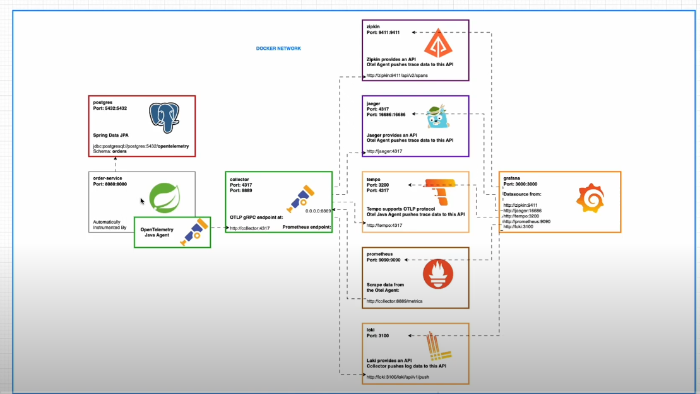

# open-telemetry-single-service-1

To use OTel setup on Java server.

This repository follows the code described by Linh Vu in this tutorial: [link](https://youtu.be/4YjaR-c0Cjc?list=PLLMxXO6kMiNg6EcNCx6C6pydmgUlDDcZY). It is only for training purposes.

Schema:


Run with:
```
docker compose up -d
```
